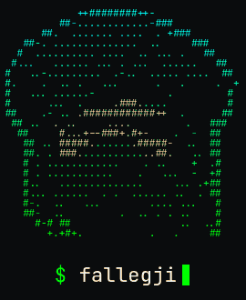

<div align="center">
  
</div>

Fallegji is a terminal-based P2P group chat app written in Rust. It's inspired by the Fallegha of north Africa who were responsible for the armed resistance against colonialism and operated in total secrecy. This app features:
- **Zero-server and fully decentralized:** No servers, no accounts, no intermediaries — every peer is a first-class node in a direct, full-mesh network, with no central point to seize, subpoena, or shut down.
- **End-to-end encrypted by construction:** Modern X25519 key exchange and ChaCha20-Poly1305 authenticated encryption protect every byte on the wire under unique pairwise keys. Plaintext never touches the network, and your history never leaves your machine.
- **Group chat that simply converges:** Each peer holds its own embedded SQLite replica that reconciles automatically on join, rejoin, and recovery — an eventually-consistent, conflict-free design with no source of truth and no dropped messages.
- **A network that heals itself:** Heartbeat-driven presence, automatic re-dialing of lost peers, and transparent IP-change / NAT re-announcement keep conversations alive through roaming and reconnects, with zero manual intervention.
- **A terminal experience that feels like home:** Full Vim-modal editing — motions, operators, and counts — alongside a mouse-draggable scrollbar, desktop notifications, and fully themeable per-chat colors. Keyboard-first and unmistakably yours.
- **Hardened against abuse from day one:** Per-peer rate limiting, strict frame-size caps (anti-OOM and anti–zip-bomb), admin-only moderation, and an automatic send-rate cutoff shrug off flooding and resource-exhaustion attacks.
- **Engineered in async Rust:** Built on Tokio for non-blocking, highly concurrent networking and a fluid ratatui interface — memory-safe, dependency-light, and cross-platform across Linux, macOS, and Windows.
#

## Installation
```bash
cargo build --release      # binary → target/release/fallegji
cargo run                  # or just run it in project root
```

Run the tests with `cargo test -- --test-threads=2` (the networked ones dislike full parallelism). Then, move the `fallegji` binary from `target/release/` to your `PATH`, whether it be a Linux or Windows machine. This last step enables simply running `fallegji`


> [!NOTE]
> Fallegji was built with the 2024 **nightly** Rust toolchain.

## Use

<!-- <video width="640" height="480" controls> -->
<!--   <source src="assets/demo.mp4" type="video/mp4"> -->
<!-- </video> -->
https://github.com/user-attachments/assets/dac36b8c-bee0-426c-8f70-eb83dc226e51

No server or accounts in the conventional sense. Peers talk directly over encrypted TCP, finding each other through a rendezvous address, typically a peer's IP address with a free port of choice.

The peer who creates the chat room is responsible for this rendezvous address and access control. Said peer is known as the admin of the chat room. If an admin's machine can control multiple IP addresses, they can choose whichever rendezvous IP they please.

In the home menu, we can set the interface (LAN or VPN) and join an already joined chat. We can also create a new chat or join one. Keep in mind that the names need to be unique per user.

Another important detail is that peers must be mutually reachable. This is trivial on a LAN, but across the internet you need to use a shared VPN (WireGuard, Tailscale, …) so the rendezvous address resolves for everyone. So, for this reason, you need to choose the same interface (VPN) each time you hop on the same chat.

The flow for an admin is pretty simple:
- Create a chat → you host the rendezvous; share its address with people you trust.
- Admins run the waitroom (`<C-a>`): accept, reject, or kick peers.

A non-admin peer is just a member. They simply need to join the chat by inputting the rendezvous address, chosen by the admin.


## Config
Lives in `~/.config/fallegji/fallegji.toml` (created on first run; `%APPDATA%` on Windows); chat history sits in `~/.local/share/fallegji/`. Global defaults go in the root, per-chat overrides in a `[user @ chat]` section:

```toml
# ── Global defaults (file root) — every key is optional ────────────────────
border_style  = "Rounded"        # plain | rounded | double | thick
max_height    = 5                # max height of the input box, in lines
notifications = true             # true | false — popup on each received message

# Colors are [r, g, b], 0–255. Omit any to keep its built-in default.
text_color    = [255, 255, 255]  # message text
bg_color      = [0, 0, 0]        # background (omit to keep your terminal's)
border_color  = [90, 90, 90]     # borders + inactive UI
my_color      = [0, 255, 0]      # your name
users_color   = [0, 255, 255]    # other people's names
system_color  = [90, 90, 90]     # join / kick / system lines
online_color  = [0, 255, 0]      # the "online" dot
normal_mode   = [0, 212, 255]    # NORMAL-mode label
insert_mode   = [255, 102, 204]  # INSERT-mode label
timeout_mode  = [255, 49, 49]    # TIMEOUT-mode label

# ── Per-chat overrides, keyed "<user> @ <chat>" ────────────────────────────
# Repeat any global key here to override it for just this chat.
["user @ chat-room"]
my_color      = [255, 0, 0]      # red, only in this room
notifications = false            # mute just this chat
```

<!-- # General checklist -->
<!-- - [ ] allow `\` commands in-text for next 2 (post release, v2.0) -->
<!-- - [ ] allow sending files -->
<!-- - [ ] allow sending videostream and soundstream (allowing for vc with cam by opening a browser) -->
<!-- - [ ] allow agents to use app (make a CLI, through arguments) -->

<!-- # advanced VIM motions checklist (v2.0): -->
<!-- - [ ] Implement `iw`, `i(`, `aw`, `a[` and such sequences -->
<!-- - [ ] Implement `f`, `F`, `t` and `T` -->
<!-- - [ ] replace and replace mode -->
<!-- - [ ] Visual mode -->
<!-- - [ ] undo/redo -->
<!-- - [ ] Implement searching with `/` and `?` -->
<!-- - [ ] input scrolling (more natural) -->
<!-- - [ ] Macros (might be a stretch) -->
